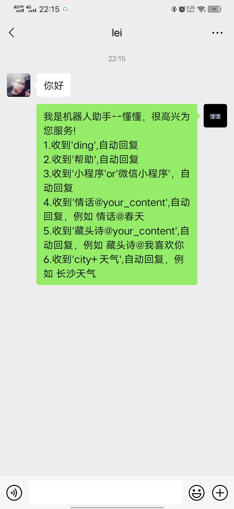
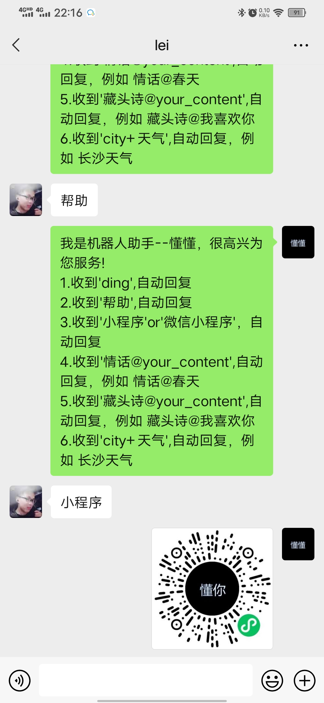
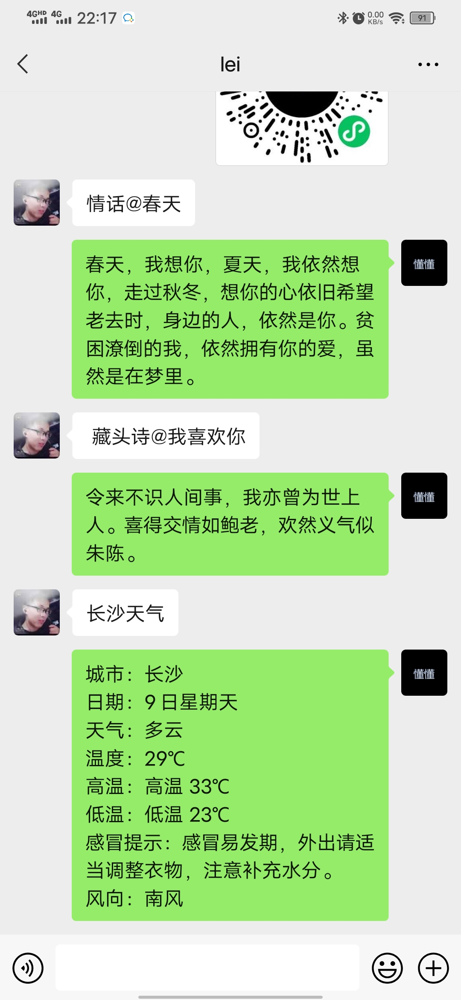
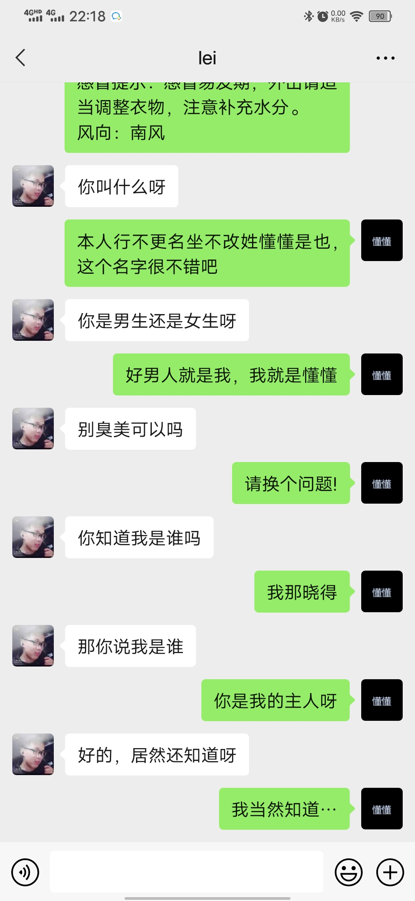

# 基于Paddlehub与Wechaty的微信小助手--懂懂

# 1.使用docker部署服务
购买云服务器:推荐 阿里云、腾讯云等，并安装docker
可参考:[教你用AI Studio+wechaty+阿里云白嫖一个智能微信机器人](https://aistudio.baidu.com/aistudio/projectdetail/1836012)

## 1.1 服务部署
[AI ChatBot 创意赛](https://aistudio.baidu.com/aistudio/competition/detail/79)提供的是PadLocal Puppet的token,
可参考[Python Wechaty如何使用PadLocal Puppet Service](https://wechaty.js.org/2021/02/03/python-wechaty-for-padlocal-puppet-service/)进行部署服务
```
docker pull wechaty/wechaty:latest
export WECHATY_LOG="verbose"
export WECHATY_PUPPET="wechaty-puppet-padlocal"
export WECHATY_PUPPET_PADLOCAL_TOKEN="puppet_padlocal_26ff2f288a7942b2a2c0496215daa5c5"    # 这里输入你自己的token
export WECHATY_PUPPET_SERVER_PORT="8080"
export WECHATY_TOKEN="888"

docker run -ti \
  --name wechaty_puppet_service_token_gateway \
  --rm \
  -e WECHATY_LOG \
  -e WECHATY_PUPPET \
  -e WECHATY_PUPPET_PADLOCAL_TOKEN \
  -e WECHATY_PUPPET_SERVER_PORT \
  -e WECHATY_TOKEN \
  -p "$WECHATY_PUPPET_SERVER_PORT:$WECHATY_PUPPET_SERVER_PORT" \
  wechaty/wechaty:latest
```

## 1.2 服务部署测试
测试地址：https://api.chatie.io/v0/hosties/888  
这里的**888**对应上面docker部署里面的WECHATY_TOKEN

> 如果返回了服务器的ip地址以及端口号，比如{"ip":"81.69.14.9","port":8080}，就说明运行成功了
>如果返回的是{"ip":"0.0.0.0","port":0}，就说明没有运行成功

# 2.项目功能

项目主要功能：
1.收到'ding',自动回复
2.收到'帮助',自动回复
3.收到'小程序'or'微信小程序'，自动回复
4.收到'情话@your_content',自动回复，例如 情话@春天
5.收到'藏头诗@your_content',自动回复，例如 藏头诗@我喜欢你
6.收到'city+天气',自动回复，例如 长沙天气
7.收到其他关键词，智能回复，例如 你叫什么名字呀

## 2.1 项目功能展示









## 2.2 项目主要代码
配置文件代码
```config.py
config_list ={
    'contact_name':'lei',
    'room_id':'7501001119@chatroom',

}
ACCEPTFRIEND=['PaddleHub', 'Wechaty', '懂懂']
```

```main.py
# 导入第三方库
import os
from wechaty import (
    Contact,
    FileBox,
    Message,
    ScanStatus,
    Wechaty,
    Friendship,
    FriendshipType
)
import asyncio
from config import config_list
import config
from typing import Optional
import paddlehub as hub
import json, requests
import hashlib
import time
import random
import string
from urllib.parse import quote

# Paddlehub文本模型
text_model1 = hub.Module(name='ernie_gen_lover_words')     # 情话模型
text_model2 = hub.Module(name="ernie_gen_acrostic_poetry", line=4, word=7)   # 藏头诗模型


# 获取城市天气
def get_weather_data(city_name):
    weatherJsonUrl = "http://wthrcdn.etouch.cn/weather_mini?city={}".format(city_name)  # 将链接定义为一个字符串
    response = requests.get(weatherJsonUrl)  # 获取并下载页面，其内容会保存在respons.text成员变量里面
    response.raise_for_status()  # 这句代码的意思如果请求失败的话就会抛出异常，请求正常就上面也不会做
    # 将json文件格式导入成python的格式
    weather_dict = json.loads(response.text)
    # print(weather_dict)
    if weather_dict['desc'] == 'invilad-citykey':
        weather_info = '请输入正确的城市名!'
    else:
        forecast = weather_dict.get('data').get('forecast')
        city = '城市：' + weather_dict.get('data').get('city') + '\n'
        date = '日期：' + forecast[0].get('date') + '\n'
        type = '天气：' + forecast[0].get('type') + '\n'
        wendu = '温度：' + weather_dict.get('data').get('wendu') + '℃ ' + '\n'
        high = '高温：' + forecast[0].get('high') + '\n'
        low = '低温：' + forecast[0].get('low') + '\n'
        ganmao = '感冒提示：' + weather_dict.get('data').get('ganmao') + '\n'
        fengxiang = '风向：' + forecast[0].get('fengxiang')
        weather_info = city + date + type + wendu + high + low + ganmao + fengxiang
    return weather_info


def curlmd5(src):
    m = hashlib.md5(src.encode('UTF-8'))
    # 将得到的MD5值所有字符转换成大写
    return m.hexdigest().upper()


def get_params(plus_item):
    global params
    # 请求时间戳（秒级），用于防止请求重放（保证签名5分钟有效）
    t = time.time()
    time_stamp = str(int(t))
    # 请求随机字符串，用于保证签名不可预测
    nonce_str = ''.join(random.sample(string.ascii_letters + string.digits, 10))
    # 应用标志，这里修改成自己的id和key
    # 注册地址：https://ai.qq.com/product/nlpchat.shtml
    app_id = '2171755636'    # your appid
    app_key = 'HYFEyQEF5U3Zkbjo'   # your app_key
    params = {'app_id': app_id,
              'question': plus_item,
              'time_stamp': time_stamp,
              'nonce_str': nonce_str,
              'session': '10000'
              }
    sign_before = ''
    # 要对key排序再拼接
    for key in sorted(params):
        # 键值拼接过程value部分需要URL编码，URL编码算法用大写字母，例如%E8。quote默认大写。
        sign_before += '{}={}&'.format(key, quote(params[key], safe=''))
    # 将应用密钥以app_key为键名，拼接到字符串sign_before末尾
    sign_before += 'app_key={}'.format(app_key)
    # 对字符串sign_before进行MD5运算，得到接口请求签名
    sign = curlmd5(sign_before)
    params['sign'] = sign
    return params

def get_content(plus_item):
    global payload, r
    # 聊天的API地址
    url = "https://api.ai.qq.com/fcgi-bin/nlp/nlp_textchat"
    # 获取请求参数
    plus_item = plus_item.encode('utf-8')
    payload = get_params(plus_item)
    r = requests.post(url, data=payload)
    res = r.json()["data"]["answer"]
    if len(res) == 0:
        res = '请换个问题!'
    return res

# 文本消息处理--机器对话
def chat_bot(content, mode):
    res = ''
    if mode == '0':
        res = get_content(content)
        # print(res)
    elif mode == '1':
        res = text_model1.generate(texts=[content], use_gpu=False, beam_width=1)
        if res is None:
            return
        res = res[0][0]
        # print(res)
    elif mode == '2':
        res = text_model2.generate(texts=[content], use_gpu=False, beam_width=1)
        if res is None:
            return
        res = res[0][0]
    return res

# debug时分割线
def dividing_line(info='分割线'):
    print('-' * 30 + info + '-' * 30)


# 发送文本消息给联系人
async def sendTextMsgToContact(contact, text):
    if not contact:  # 好友不存在直接返回
        return
    await contact.say(text)  # 调用contact对象的say方法发送消息，contact对象很多方法，参考官方文档


# 发送媒体消息给联系人
async def sendMediaMsgToContact(contact, fileUrl, filePath):
    # print(contact)
    if not contact:  # 好友不存在直接返回
        return
    if fileUrl:
        fileBox1 = FileBox.from_url(url=fileUrl, name='wxapplet.png')
        await contact.say(fileBox1)
    if filePath:
        fileBox2 = FileBox.from_file(filePath)
        await contact.say(fileBox2)

# 定义懂懂机器人类
class MyBot(Wechaty):
    """
    listen wechaty event with inherited functions, which is more friendly for
    oop developer
    """

    def __init__(self):
        super().__init__()

    async def on_message(self, msg: Message):
        """
        Message Handler for the Bot
        """
        contact = msg.talker()  # 发消息人
        content = msg.text()  # 消息内容
        room = msg.room()  # 是否是群消息
        contact_name = contact.name
        if room:  # 群聊入口，未做任何处理
            if room.room_id == config_list['room_id'] and (msg.type() == Message.Type.MESSAGE_TYPE_TEXT):
                print('群聊')
                room_id = room.room_id
                print('群名:{},发消息人:{},内容:{}'.format(room_id, contact_name, content))
                print('使用API发送群消息')
        else:
            dividing_line()
            print('非群聊')
            if msg.type() == Message.Type.MESSAGE_TYPE_TEXT:  # 处理文本类型消息
                if content == 'ding':
                    await sendTextMsgToContact(contact=contact, text="这是自动回复: dong dong dong")
                elif content == 'hi' or content == '你好' or content == "帮助":
                    info0 = "我是机器人助手--懂懂，很高兴为您服务!\n"
                    info1 = "1.收到'ding',自动回复\n"
                    info2 = "2.收到'帮助',自动回复\n"
                    info3 = "3.收到'小程序'or'微信小程序'，自动回复\n"
                    info4 = "4.收到'情话@your_content',自动回复，例如 情话@春天\n"
                    info5 = "5.收到'藏头诗@your_content',自动回复，例如 藏头诗@我喜欢你\n"
                    info6 = "6.收到'city+天气',自动回复，例如 长沙天气\n"
                    help_info = info0 + info1 + info2 + info3 + info4 + info5 + info6
                    await sendTextMsgToContact(contact=contact, text=help_info)
                elif content == '小程序' or content == "微信小程序":
                    file_url = 'https://upload-images.jianshu.io/upload_images/10519098-690ae0fde75147a1.png' \
                               '?imageMogr2/auto-orient/strip%7CimageView2/2/w/1240'
                    await sendMediaMsgToContact(contact=contact, fileUrl=file_url, filePath='')
                elif '天气' in content:
                    city_name = content[:-2]
                    weather_info = get_weather_data(city_name)
                    await contact.say(weather_info)
                elif "情话" in content:
                    content = content[3:]
                    res = chat_bot(content=content, mode='1')
                    await contact.say(res)
                elif "藏头诗" in content:
                    # 藏头诗模式
                    content = content[4:]
                    res = chat_bot(content=content, mode='2')
                    await contact.say(res)
                else:
                    res = chat_bot(content=content, mode='0')
                    await contact.say(res)
            #  处理图片类型消息
            elif msg.type() == Message.Type.MESSAGE_TYPE_IMAGE:
                dividing_line()
                await contact.say('不好意思,暂时处理不了图片类型消息,我们已经在催程序员小哥哥日夜加班优化项目了!希望您能够理解!')


    async def on_scan(self, qr_code: str, status: ScanStatus,
                      data: Optional[str] = None):
        """
        Scan Handler for the Bot
        """
        print('Scan QR Code to login: {}\n'.format(status))
        print('View QR Code Online: https://wechaty.js.org/qrcode/{}'.format(qr_code))

    async def on_login(self, contact: Contact):
        """
        Login Handler for the Bot
        """
        print(f'User {contact} logged in\n')
        # TODO: To be written

    async def on_logout(self, contact: Contact):
        print(f'User <{contact}> logout')

    async def on_friendship(self, friendship: Friendship):
        name = friendship.contact().name
        hello = friendship.hello()
        logMsg = name + '发送了好友请求'
        print(logMsg)
        # print(hello)
        try:
            if friendship.type() == FriendshipType.FRIENDSHIP_TYPE_RECEIVE:
                if len(config.ACCEPTFRIEND) == 0:
                    print('无认证关键词,自动通过好友请求')
                    await friendship.accept()
                elif len(config.ACCEPTFRIEND) > 0 and (hello in config.ACCEPTFRIEND):
                    print('触发关键词{},自动通过好友请求'.format(hello))
                    await friendship.accept()
            elif friendship.type() == Friendship.Type.Confirm:
                logMsg = name + '已确认添加好友'
                print(logMsg)
            else:
                print('我不能同意你成为我的好友')
        except:
            print('添加好友出错')


async def main():
    """
    Async Main Entry
    """
    # 配置token
    os.environ['WECHATY_PUPPET'] = "wechaty-puppet-sevice"
    # 对应docker部署的token
    Token = "888"
    os.environ['WECHATY_PUPPET_SERVICE_TOKEN'] = Token
    # 对应docker部署的地址
    os.environ['WECHATY_PUPPET_SERVICE_ENDPOINT'] = "81.69.14.8:8080"
    # Make sure we have set WECHATY_PUPPET_SERVICE_TOKEN in the environment variables.
    if 'WECHATY_PUPPET_SERVICE_TOKEN' not in os.environ:
        print('''
            Error: WECHATY_PUPPET_SERVICE_TOKEN is not found in the environment variables
            You need a TOKEN to run the Python Wechaty. Please goto our README for details
            https://github.com/wechaty/python-wechaty-getting-started/#wechaty_puppet_service_token
        ''')
    global bot
    bot = MyBot()
    await bot.start()


if __name__ == '__main__':
    asyncio.run(main())

```
# 3.个人心得
通过这次比赛认识了很多大佬,收获很多，自己的项目也出现了很多bug,目前的机器人功能还不是特别完善，希望等自己有空闲时间去不断完善自己的项目，当然也欢迎各位小伙伴的加入，可以评论区留言!

# 4.参考链接
* [PaddleHub官网](https://www.paddlepaddle.org.cn/hub)
* [wechaty官网](https://wechaty.js.org/)
* [教你用AI Studio+wechaty+阿里云白嫖一个智能微信机器人](https://aistudio.baidu.com/aistudio/projectdetail/1836012)
* [Python Wechaty如何使用PadLocal Puppet Service](https://wechaty.js.org/2021/02/03/python-wechaty-for-padlocal-puppet-service/)
* [手把手教你做个用AI续写情话的Wechaty聊天机器人](https://www.bilibili.com/video/BV1BB4y1A714)
* [熊猫头表情生成器[Wechaty+Paddlehub]](https://aistudio.baidu.com/aistudio/projectdetail/1869462)
* [用PaddleHub制作藏头诗，人物动漫画与新海城风格，结合wechaty](https://aistudio.baidu.com/aistudio/projectdetail/1878140)
* [我要What系列 WeChaty + PaddleHub](https://aistudio.baidu.com/aistudio/projectdetail/1892145)
* [基于paddlehub和wechaty实现一句话给你emoji过来](https://aistudio.baidu.com/aistudio/projectdetail/1877672)
* [在未来流浪：基于WeChaty, PaddleHub与彩云小梦的科幻机器人](https://aistudio.baidu.com/aistudio/projectdetail/1896705)

# 5.个人介绍
> 中南大学 机电工程学院 机械工程专业 2019级 研究生 雷钢

> 百度飞桨官方帮帮团成员

> Github地址：https://github.com/leigangblog

> Gitee地址：https://gitee.com/leigangblog

> B站：https://space.bilibili.com/53420969

来AI Studio互关吧，等你哦~ https://aistudio.baidu.com/aistudio/personalcenter/thirdview/118783
欢迎大家fork喜欢评论三连，感兴趣的朋友也可互相关注一下啊~


